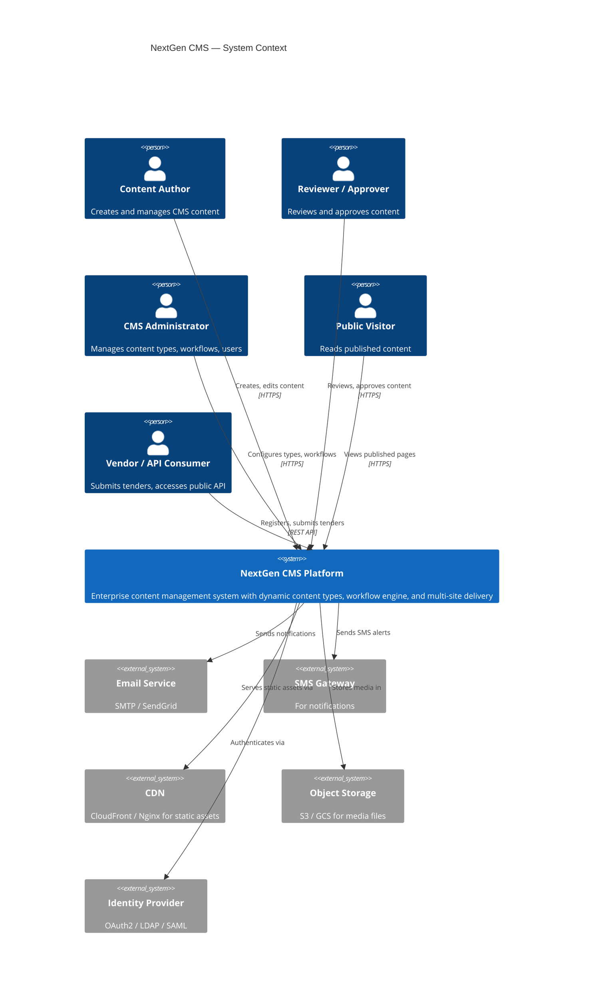
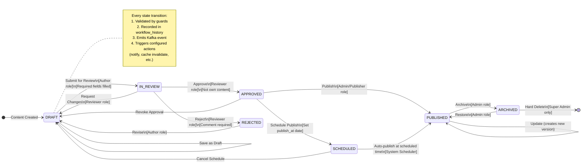
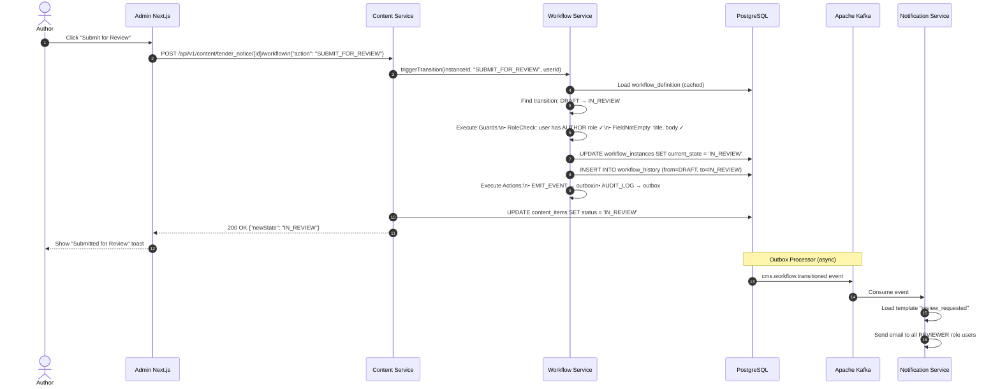
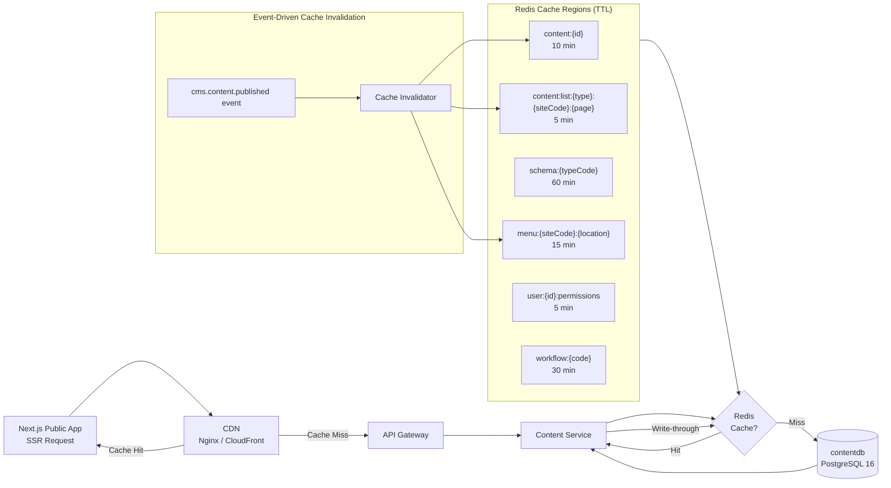
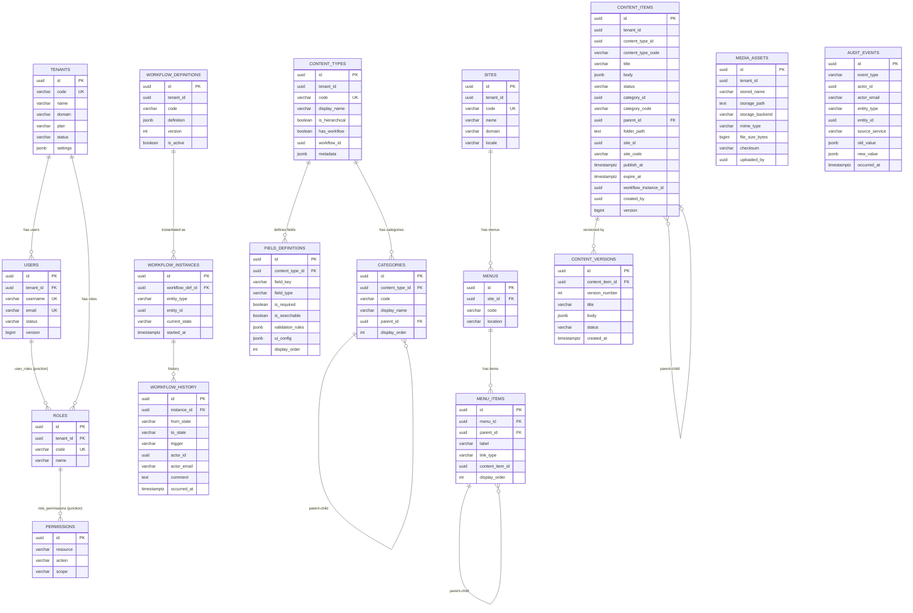
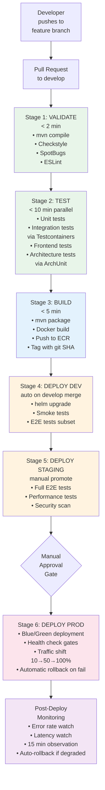
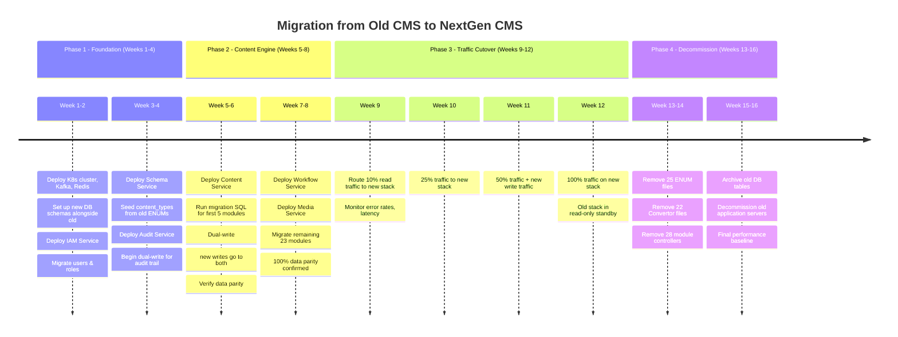
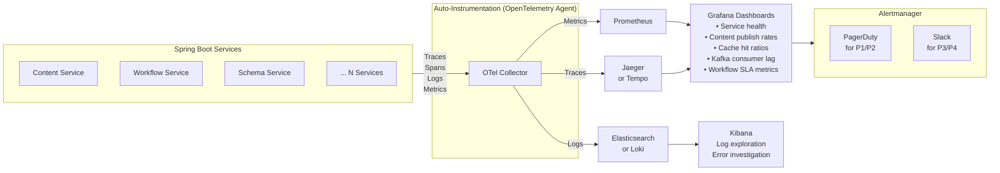

# NextGen CMS — Architecture Diagrams

All diagrams use Mermaid syntax. Render at https://mermaid.live or any Mermaid-compatible viewer.

---

## DIAGRAM 1: System Context (C4 Level 1)



---

## DIAGRAM 2: Microservices Architecture (C4 Level 2)

```mermaid
C4Container
    title NextGen CMS — Container Diagram (Database-per-Service)

    Person(user, "CMS User", "Author, Reviewer, Admin")
    Person(visitor, "Public Visitor")

    Container_Boundary(frontend, "Frontend") {
        Container(admin_app, "Admin Next.js App", "Next.js 14 + TypeScript", "CMS admin interface — dynamic forms, workflow UI, schema designer")
        Container(public_app, "Public Next.js App", "Next.js 14 + TypeScript", "Public-facing website with SSR/ISR content delivery")
    }

    Container_Boundary(gateway, "API Gateway") {
        Container(apigw, "API Gateway", "Kong / Nginx", "JWT validation, rate limiting, routing, SSL termination")
    }

    Container_Boundary(services, "Microservices") {
        Container(content_svc, "Content Service", "Spring Boot 3 / Java 21", "Universal content CRUD, lifecycle, versioning. Replaces all 28 module services.")
        Container(schema_svc, "Schema Service", "Spring Boot 3 / Java 21", "Dynamic content type registry, field definitions, categories, sites, menus")
        Container(workflow_svc, "Workflow Service", "Spring Boot 3 / Java 21", "Data-driven state machine engine for content approval workflows")
        Container(media_svc, "Media Service", "Spring Boot 3 / Java 21", "File upload, storage backend abstraction, thumbnail generation")
        Container(iam_svc, "IAM Service", "Spring Boot 3 / Java 21", "Tenants, users, roles, permissions, JWT issuance, RBAC enforcement")
        Container(form_svc, "Form Service", "Spring Boot 3 / Java 21", "Dynamic form schema management and submission handling")
        Container(search_svc, "Search Service", "Spring Boot 3 / Java 21", "Full-text search, faceted filtering, OpenSearch index management")
        Container(notif_svc, "Notification Service", "Spring Boot 3 / Java 21", "Email, SMS, in-app notification dispatch via templates")
        Container(audit_svc, "Audit Service", "Spring Boot 3 / Java 21", "Append-only immutable event log — pure Kafka consumer")
    }

    Container_Boundary(infra, "Infrastructure (Shared)") {
        Container(kafka, "Apache Kafka", "Message Broker", "Event streaming: content lifecycle, workflow transitions, media events")
        Container(redis, "Redis Cluster", "Cache", "Content cache, session store, schema cache, permission cache, menu cache")
    }

    Container_Boundary(dbs, "Databases (9 Separate Instances)") {
        ContainerDb(iamdb, "iamdb", "PostgreSQL 16", "tenants, users, roles, permissions, api_keys, refresh_tokens, outbox_events")
        ContainerDb(schemadb, "schemadb", "PostgreSQL 16", "content_types, field_definitions, categories, sites, menus, menu_items, outbox_events")
        ContainerDb(contentdb, "contentdb", "PostgreSQL 16", "content_items (JSONB body), content_versions, outbox_events")
        ContainerDb(workflowdb, "workflowdb", "PostgreSQL 16", "workflow_definitions, workflow_instances, workflow_history, outbox_events")
        ContainerDb(mediadb, "mediadb", "PostgreSQL 16", "media_assets, outbox_events")
        ContainerDb(formdb, "formdb", "PostgreSQL 16", "form_definitions, form_submissions, outbox_events")
        ContainerDb(opensearch, "searchstore", "OpenSearch 2.x", "Denormalized search documents — one index per tenant")
        ContainerDb(notifdb, "notificationdb", "PostgreSQL 16", "notification_templates, notification_log, outbox_events")
        ContainerDb(auditdb, "auditdb", "PostgreSQL 16 (partitioned)", "audit_events partitioned by month — append-only, no outbox")
    }

    Rel(user, admin_app, "Uses", "HTTPS")
    Rel(visitor, public_app, "Views", "HTTPS")
    Rel(admin_app, apigw, "API calls", "REST/HTTPS")
    Rel(public_app, apigw, "API calls", "REST/HTTPS")

    Rel(apigw, content_svc, "Routes to", "HTTP")
    Rel(apigw, schema_svc, "Routes to", "HTTP")
    Rel(apigw, workflow_svc, "Routes to", "HTTP")
    Rel(apigw, media_svc, "Routes to", "HTTP")
    Rel(apigw, iam_svc, "Routes to", "HTTP")
    Rel(apigw, search_svc, "Routes to", "HTTP")

    Rel(iam_svc, iamdb, "Reads/Writes", "JDBC")
    Rel(iam_svc, kafka, "Publishes events", "Kafka")

    Rel(schema_svc, schemadb, "Reads/Writes", "JDBC")
    Rel(schema_svc, kafka, "Publishes events", "Kafka")
    Rel(schema_svc, redis, "Caches schema", "Redis Protocol")

    Rel(content_svc, contentdb, "Reads/Writes", "JDBC")
    Rel(content_svc, kafka, "Publishes events", "Kafka")
    Rel(content_svc, redis, "Caches content", "Redis Protocol")
    Rel(content_svc, schema_svc, "Validates against schema", "HTTP/gRPC")
    Rel(content_svc, workflow_svc, "Triggers transitions", "HTTP/gRPC")

    Rel(workflow_svc, workflowdb, "Reads/Writes", "JDBC")
    Rel(workflow_svc, kafka, "Publishes events", "Kafka")

    Rel(media_svc, mediadb, "Reads/Writes", "JDBC")
    Rel(media_svc, kafka, "Publishes events", "Kafka")

    Rel(form_svc, formdb, "Reads/Writes", "JDBC")
    Rel(form_svc, kafka, "Publishes events", "Kafka")

    Rel(search_svc, kafka, "Consumes events", "Kafka")
    Rel(search_svc, opensearch, "Indexes/Queries", "HTTP")

    Rel(notif_svc, notifdb, "Reads/Writes", "JDBC")
    Rel(notif_svc, kafka, "Consumes events", "Kafka")

    Rel(audit_svc, kafka, "Consumes all events", "Kafka")
    Rel(audit_svc, auditdb, "Writes (append-only)", "JDBC")
```



---

## DIAGRAM 3: Content Lifecycle State Machine



---

## DIAGRAM 4: Dynamic Content Type — Data Flow

```mermaid
flowchart TD
    A[Admin: Create Content Type\n'tender_notice'] --> B[schema-service\nPOST /api/v1/schema/types]
    B --> C[(schemadb\ncontent_types\n+ field_definitions\n+ categories)]
    C --> D[Schema cache\ninvalidated in Redis]
    D --> E[Other services notified\nvia Kafka: cms.schema.changed]

    F[Author: Open Admin UI\nContent → Tender Notice → New] --> G[Admin Next.js App\nGET /api/v1/schema/types/tender_notice]
    G --> H{Schema in\nRedis cache?}
    H -- Yes --> I[Return cached schema]
    H -- No --> J[content-service queries\nschema-service]
    J --> I

    I --> K[DynamicForm.tsx\nrenders form from\nfield_definitions JSON]

    K --> L[Author fills in\ntender details\nand submits]
    L --> M[POST /api/v1/content/tender_notice]
    M --> N[content-service\nvalidates body\nagainst field_definitions]
    N --> O{Valid?}
    O -- No --> P[Return 400\nvalidation errors]
    O -- Yes --> Q[Save to\ncontentdb.content.content_items\nbody JSONB column + site_id + site_code]
    Q --> R[Write to contentdb.content.outbox_events\n(same transaction)]
    R --> S[Return 201 Created]

    T[Debezium CDC\ncontentdb connector] --> U[cms.content.created\nKafka event]
    U --> V[audit-service\nlogs the creation]
    U --> W[search-service\nindexes to OpenSearch]
```

---

## DIAGRAM 5: Workflow Engine — Request Flow



---

## DIAGRAM 6: Caching Architecture



---

## DIAGRAM 7: PostgreSQL Schema Relationships (ERD)



---

## DIAGRAM 8: CI/CD Pipeline



---

## DIAGRAM 9: Migration Strategy (Strangler Fig Pattern)



---

## DIAGRAM 10: Observability Stack


